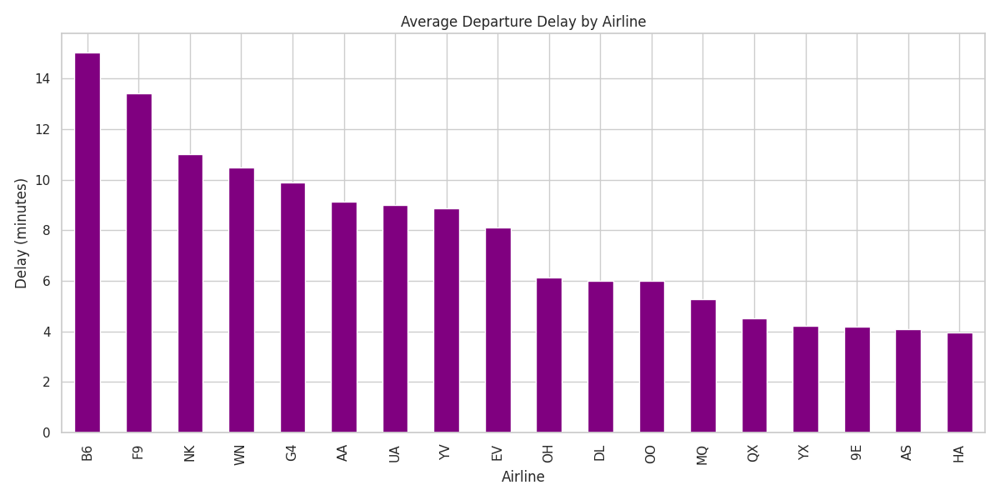
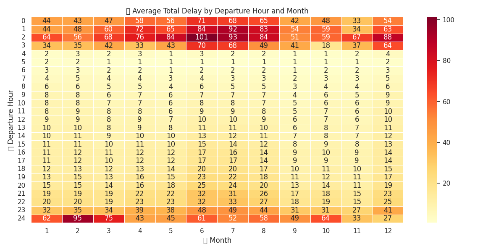

# ✈️ Flight Delay Analysis / Аналіз Затримок Рейсів

---

## 📄 Summary / Опис

This project analyzes flight delays using a dataset of 3 million records.  
We explore which factors cause delays, when and where they happen most often, and visualize patterns.  
The project demonstrates data cleaning, analysis, visualization, and insights extraction.

Цей проєкт аналізує затримки авіарейсів на основі вибірки з 3 мільйонів записів.  
Ми досліджуємо, що спричиняє затримки, коли і де вони найчастіші, візуалізуємо закономірності.  
Мета — продемонструвати вміння в аналітиці, очищенні та візуалізації даних.

---

## 🎯 Objectives / Цілі

- Understand the main causes of flight delays.
- Identify patterns by time, airline, and location.
- Practice data wrangling, visualization, and storytelling.
- Create a presentable portfolio project for GitHub.

---

## 📊 Dataset

- 📁 File: `flights_sample_3m.csv`,https://drive.google.com/file/d/1uuv4AzuoHFjo2HCsVbEeDVEAb9GaQdq1/view?usp=sharing
- https://drive.google.com/file/d/1_lka8aI1Pml2z1FKqKq9CYRgYk5-rnA8/view?usp=sharing
- 📦 Size: ~3 million records
- 📌 Columns: `FL_DATE`, `ORIGIN`, `DEST`, `CARRIER`, `DEP_DELAY`, `ARR_DELAY`, `DEP_HOUR`, `CANCELLED`, various delay types

---

## 🧰 Stack / Технології

- Python (Pandas, NumPy, Matplotlib, Seaborn)
- Google Colab
- SQL (Looker Studio – optional)
- Tableau (optional)
- Google Sheets (optional)

---

## 🧹 Data Cleaning

- Removed missing, duplicated, and invalid values
- Parsed datetime fields
- Filtered cancelled/diverted flights
- Combined individual delay reasons into a `TOTAL_DELAY` column

---

## 📈 EDA & Visualizations / Візуалізації

### ✈️ Average Departure Delay by Airline

---

### 🕒 Delay by Departure Hour
[![Hourly delay] (figures/hourly_delay.png) ([https://github.com/kunitskiialex/Flight_Delay_Analysis/blob/main/hourly_delay.png](https://github.com/kunitskiialex/Flight_Delay_Analysis/blob/main/figures/hourly_delay.png?raw=true))

---

### 🔥 Heatmap: Average Delay by Month & Hour
)
---

### 🗺️ Delay by Origin Airport

---

## 🧠 Key Insights / Висновки

- Most delays occur between 4–8 PM (rush hours).
- Summer months (June–August) have the highest average delays.
- Late aircraft and carrier issues are the top reasons.
- Airlines differ greatly in delay behavior — some are consistently worse.

---

## 📂 Project Structure

## 📊 SQL Data Preparation & Google Sheets Dashboard

### SQL Data Cleaning & Analysis
To demonstrate SQL proficiency, we used **DBeaver with PostgreSQL** to clean and analyze the raw flight dataset. The SQL script performs:

- Data Type Standardization (dates, numeric fields)
- Data Cleaning (handling NULLs, incorrect formats)
- Feature Engineering (ROUTE, DEP_HOUR, etc.)
- Aggregated Analytical Queries:
  - Average delay by Airline
  - Flight volume per Month
  - Average delay by Departure Hour
  - Top 10 Routes with the highest Arrival Delays

📄 **SQL Script**: [/sql/flight_delay_cleaning_and_analysis.sql](./sql/flight_delay_cleaning_and_analysis.sql)

### Exported Query Results:
The results of the SQL queries were exported to CSV files and used for visualization in Google Sheets.

📂 Folder: [/data/cleaned_sql_outputs/](./data/cleaned_sql_outputs/)

---

### Google Sheets Interactive Dashboard
We created an interactive dashboard using **Google Sheets**, demonstrating the ability to build real-time visual analytics without BI tools.

Dashboard Features:
- Pivot Tables for Airline and Route analysis
- Slicers (Airline, Month, Hour) controlling all charts and tables
- KPI Summary Cards
- Visualizations (Bar Charts, Line Charts)

📊 **Live Dashboard Link**: [View Google Sheets Dashboard]((https://docs.google.com/spreadsheets/d/11krsk7PutKf4ZDu38z-Ji4iirhx49h0zEpUBD92J6e8/edit?usp=sharing))

---

### 🛠️ Skills Demonstrated:
- SQL Data Cleaning & Aggregation
- Pivot Table and KPI Creation
- Slicer-based Dashboard Filtering
- Data Storytelling via Google Sheets

